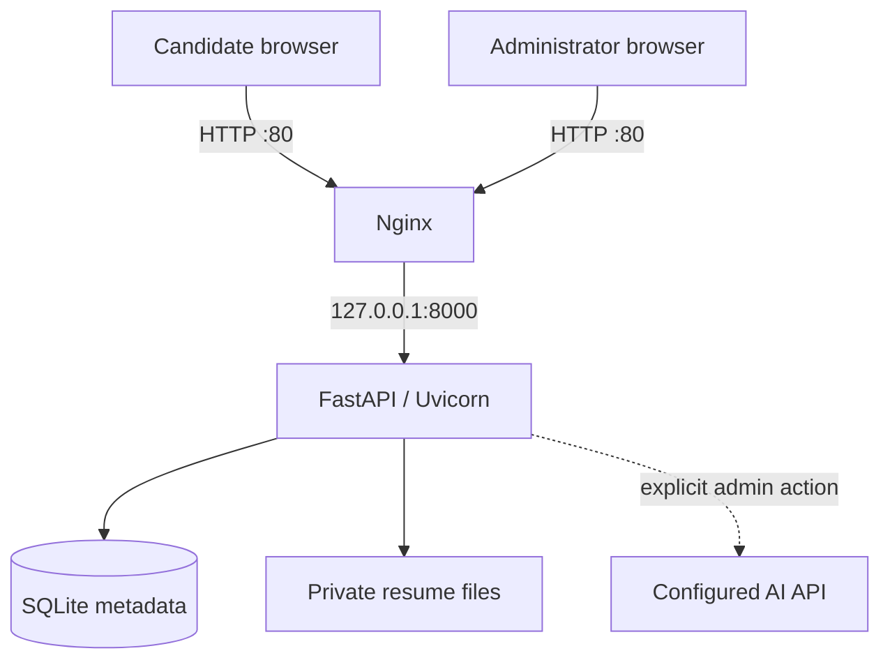

# Bite Hunt Careers

Bite Hunt Careers is a self-hosted recruitment site for Ubuntu 22.04 and newer. Candidates can read the company brief and open roles, upload a resume, and receive a reference code. A private hiring desk lets the team search applications, download resumes, update pipeline status, keep internal notes and scores, request a DeepSeek-assisted role match analysis, and permanently delete an application when it is no longer needed.

The visual system follows the supplied Bite Hunt poster: editorial off-white surfaces, deep campus green, and a restrained orange action color. The public site and hiring desk are responsive and use no external fonts, trackers, CDNs, or browser-side data stores.

## What is included

- Public company, mission, values, and open-role pages
- Resume application form for PDF, DOC, and DOCX files
- Private administrator login with signed, HTTP-only session cookies
- Search, role/status filters, pipeline status, private notes, and a 0-100 team score
- Protected resume downloads; the upload directory is never public
- SQLite metadata and Linux filesystem document storage
- DeepSeek `deepseek-v4-pro` analysis through its OpenAI-compatible chat-completions API
- Weighted role-match scoring, strengths, gaps, resume evidence, and scored interview prompts
- Confirmed deletion of application metadata, AI history, and the private resume file
- Nginx on port 80, Uvicorn application service on `127.0.0.1:8000`
- `systemd` service hardening, rate limits, CSRF protection, upload validation, and security headers
- Interactive and non-interactive Ubuntu installation
- Automated end-to-end server tests

## Architecture



The database stores searchable metadata and workflow state. Resume bytes live below `/var/lib/bite-hunt/uploads`; only authenticated application code can read them. An AI request is never automatic: an administrator must click **Analyze match** for one application. The total AI score is calculated in application code from four model-scored dimensions: role requirements (35%), relevant experience (25%), skills and tools (25%), and evidence of impact (15%). It remains decision support, not an automated hiring decision.

## One-command Ubuntu deployment

Copy the project archive to a clean Ubuntu 22.04+ server, extract it, enter the directory, then run:

```bash
sudo bash scripts/install_ubuntu.sh
```

The installer asks for an administrator username, a password of at least 12 characters, and an optional DeepSeek API key. It then:

1. installs Python, Nginx, SQLite, and required runtime packages;
2. creates an unprivileged `bitehunt` service account;
3. installs the application below `/opt/bite-hunt-careers`;
4. creates private data directories below `/var/lib/bite-hunt`;
5. writes `/etc/bite-hunt/config.json`, `/etc/bite-hunt/deepseek.json`, and the optional service environment file;
6. enables the application and Nginx services; and
7. verifies that the unprivileged service account can execute the Python environment and read the templates; and
8. smoke-tests the health endpoint, rendered homepage, CSS, and JavaScript through both Uvicorn and Nginx.

Open these pages after installation:

- `http://SERVER_IP/`
- `http://SERVER_IP/admin/login`

For automated provisioning:

```bash
sudo env \
  BITEHUNT_ADMIN_USERNAME=admin \
  BITEHUNT_ADMIN_PASSWORD='replace-with-a-long-password' \
  BITEHUNT_DEEPSEEK_API_KEY='replace-with-your-deepseek-key' \
  BITEHUNT_SERVER_NAME=example.com \
  BITEHUNT_BASE_URL=http://example.com \
  BITEHUNT_TRUSTED_HOSTS=203.0.113.10 \
  bash scripts/install_ubuntu.sh
```

`BITEHUNT_SERVER_NAME` accepts one hostname, IP address, or `_`. `BITEHUNT_TRUSTED_HOSTS` is an optional comma-separated list of additional domain names or IP addresses that may be used to open the site. The host from `BITEHUNT_BASE_URL`, localhost, and `127.0.0.1` are always included. Re-running the installer installs a new code release and preserves the current configuration, DeepSeek key, database, and resumes. Set `BITEHUNT_RECONFIGURE=1` only when you intentionally want a new main configuration and administrator password. Set `BITEHUNT_RECONFIGURE_AI=1` only when you intentionally want to replace the DeepSeek configuration. Existing files are backed up first.

## Configuration

The production configuration is `/etc/bite-hunt/config.json`. After changing it, validate the JSON and restart the service:

```bash
sudo python3 -m json.tool /etc/bite-hunt/config.json >/dev/null
sudo systemctl restart bite-hunt-careers
```

Important settings:

| Section | Setting | Purpose |
| --- | --- | --- |
| `app` | `base_url` | Canonical public origin |
| `app` | `cookie_secure` | Set to `true` after HTTPS is enabled |
| `app` | `trusted_hosts` | Allowed hostnames; replace `*` when a domain is known |
| `storage` | `database_path` | SQLite database file |
| `storage` | `resume_dir` | Private resume root |
| `storage` | `max_upload_mb` | Application-side upload limit, 1-50 MB |
| `storage` | `allowed_extensions` | Any subset of `pdf`, `doc`, and `docx` |
| `security` | `application_limit_per_hour` | Per-process submission throttle |
| `security` | `login_limit_per_15_minutes` | Per-process login throttle |
| `ai` | `enabled` | Master switch for AI analysis |
| `ai` | `config_path` | Private provider configuration; production default is `/etc/bite-hunt/deepseek.json` |
| `ai` | `timeout_seconds` | Maximum wait for one analysis request |
| `ai` | `max_resume_characters` | Resume text limit sent to the model |

The DeepSeek API key is kept in `/etc/bite-hunt/deepseek.json`, which the installer makes readable only by root and the `bitehunt` service group. The key is never sent to the browser or written to application logs.

### Configure DeepSeek

The installer creates `/etc/bite-hunt/deepseek.json` even when you leave the key blank. Add the key from the [DeepSeek API keys page](https://platform.deepseek.com/api_keys):

```json
{
  "provider": "deepseek",
  "base_url": "https://api.deepseek.com",
  "endpoint_path": "/chat/completions",
  "api_key": "your-deepseek-api-key",
  "model": "deepseek-v4-pro",
  "max_output_tokens": 6000
}
```

Apply permissions and restart:

```bash
sudo chown root:bitehunt /etc/bite-hunt/deepseek.json
sudo chmod 0640 /etc/bite-hunt/deepseek.json
sudo python3 -m json.tool /etc/bite-hunt/deepseek.json >/dev/null
sudo systemctl restart bite-hunt-careers
```

The adapter sends `response_format: {"type": "json_object"}` through the OpenAI-compatible chat-completions endpoint and explicitly disables thinking mode for this structured task. If DeepSeek returns the documented occasional empty JSON response, the application retries once with a stricter prompt. Resume content is treated as untrusted input, protected-trait scoring is forbidden in the system prompt, and the server validates and bounds every saved result. To support another provider or protocol later, add a provider branch in `app/ai.py`; analysis, storage, and rendering are already separated from provider configuration.

When an analysis fails, the hiring desk now distinguishes invalid credentials, insufficient balance, rate limits, provider errors, timeouts, and server connectivity failures. It includes a short provider message when safe, but never displays the configured API key. Check the service log for the corresponding server-side event:

```bash
sudo journalctl -u bite-hunt-careers -n 100 --no-pager
```

### Delete an application

Open the application in the hiring desk, go to **Danger zone**, and type its full reference code. The browser shows when the code matches; pasted whitespace, letter case, full-width characters, and common Unicode dash variants are normalized by both the browser and server. Deletion removes the application row, all linked AI analyses, and the stored resume. This action is permanent and cannot be undone; take a backup first when retention policy requires one.

## Administrator password

Change the username or password without editing a hash manually:

```bash
sudo /opt/bite-hunt-careers/venv/bin/python \
  /opt/bite-hunt-careers/current/scripts/set_admin_password.py \
  --config /etc/bite-hunt/config.json
sudo systemctl restart bite-hunt-careers
```

## Operations

Update an existing Git checkout and deploy the new code while preserving the current configuration, database, resumes, and DeepSeek key:

```bash
cd /path/to/resume_web
git pull --ff-only origin main
sudo bash scripts/install_ubuntu.sh
```

Service status and logs:

```bash
sudo systemctl status bite-hunt-careers nginx
sudo journalctl -u bite-hunt-careers -f
```

Run the included deployment checks:

```bash
sudo bash /opt/bite-hunt-careers/current/scripts/doctor.sh
```

The doctor runs its Python import check as the actual `bitehunt` service user and verifies the complete page plus static assets through Uvicorn and Nginx. If Nginx shows `502 Bad Gateway`, reinstall this release and run the doctor; releases before 1.1.2 could create a root-only virtual environment when installed with the secure `027` umask.

Back up both structured data and resume files. A consistent small-site backup can be taken while the service is stopped:

```bash
sudo systemctl stop bite-hunt-careers
sudo tar -C / -czf bite-hunt-backup.tar.gz etc/bite-hunt var/lib/bite-hunt
sudo systemctl start bite-hunt-careers
```

The requested deployment listens on plain HTTP port 80. Before accepting real resumes over the public internet, add TLS (for example, Certbot with the Nginx plugin), change `app.base_url` to `https://...`, set `app.cookie_secure` to `true`, and restart the service.

## Local development

```bash
python3 -m venv .venv
. .venv/bin/activate
pip install -r requirements-dev.txt
python scripts/render_config.py \
  --output config/config.local.json \
  --data-dir var \
  --base-url http://127.0.0.1:8000 \
  --trusted-host 127.0.0.1
# Optional for local AI analysis; add api_key to this ignored file.
cp config/deepseek.example.json config/deepseek.json
BITE_HUNT_CONFIG=config/config.local.json \
  uvicorn app.main:create_app --factory --reload
```

Run the tests:

```bash
pytest -q
```

## Project layout

```text
app/                 FastAPI application, templates, and static assets
config/              Documented configuration examples
deploy/              Nginx and systemd templates
scripts/             Installer, configuration, password, and health tools
tests/               Application and security workflow tests
```
