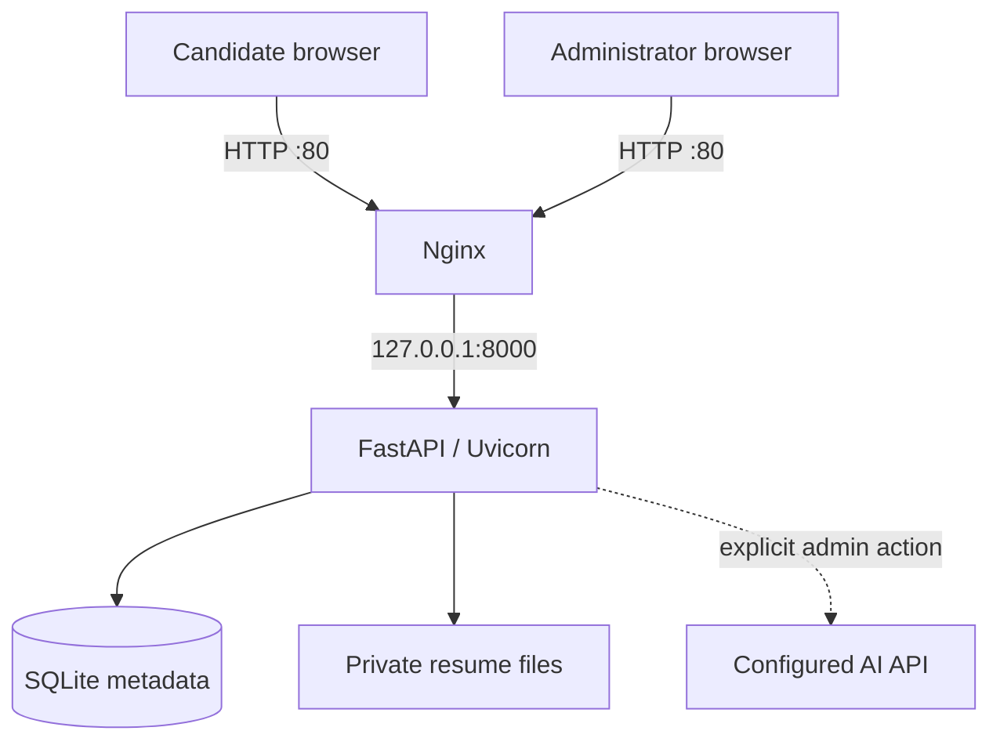

# Bite Hunt Careers

Bite Hunt Careers is a self-hosted recruitment site for Ubuntu 22.04 and newer. Candidates can read the company brief and open roles, upload a resume, and receive a reference code. A private hiring desk lets the team search applications, download resumes, update pipeline status, keep internal notes, and optionally request an AI-assisted evaluation.

The visual system follows the supplied Bite Hunt poster: editorial off-white surfaces, deep campus green, and a restrained orange action color. The public site and hiring desk are responsive and use no external fonts, trackers, CDNs, or browser-side data stores.

## What is included

- Public company, mission, values, and open-role pages
- Resume application form for PDF, DOC, and DOCX files
- Private administrator login with signed, HTTP-only session cookies
- Search, role/status filters, pipeline status, and private notes
- Protected resume downloads; the upload directory is never public
- SQLite metadata and Linux filesystem document storage
- Optional OpenAI-compatible evaluation adapter, disabled by default
- Nginx on port 80, Uvicorn application service on `127.0.0.1:8000`
- `systemd` service hardening, rate limits, CSRF protection, upload validation, and security headers
- Interactive and non-interactive Ubuntu installation
- Automated end-to-end server tests

## Architecture



The database stores searchable metadata and workflow state. Resume bytes live below `/var/lib/bite-hunt/uploads`; only authenticated application code can read them. An AI request is never automatic: the administrator must enable the adapter and click **Evaluate resume** for one application.

## One-command Ubuntu deployment

Copy the project archive to a clean Ubuntu 22.04+ server, extract it, enter the directory, then run:

```bash
sudo bash scripts/install_ubuntu.sh
```

The installer asks for an administrator username and a password of at least 12 characters. It then:

1. installs Python, Nginx, SQLite, and required runtime packages;
2. creates an unprivileged `bitehunt` service account;
3. installs the application below `/opt/bite-hunt-careers`;
4. creates private data directories below `/var/lib/bite-hunt`;
5. writes `/etc/bite-hunt/config.json` and the secret environment file;
6. enables the application and Nginx services; and
7. checks the local health endpoint.

Open these pages after installation:

- `http://SERVER_IP/`
- `http://SERVER_IP/admin/login`

For automated provisioning:

```bash
sudo env \
  BITEHUNT_ADMIN_USERNAME=admin \
  BITEHUNT_ADMIN_PASSWORD='replace-with-a-long-password' \
  BITEHUNT_SERVER_NAME=example.com \
  BITEHUNT_BASE_URL=http://example.com \
  bash scripts/install_ubuntu.sh
```

`BITEHUNT_SERVER_NAME` accepts one hostname, IP address, or `_`. Re-running the installer installs a new code release and preserves the current configuration and data. Set `BITEHUNT_RECONFIGURE=1` only when you intentionally want a new configuration and administrator password; the previous config is backed up first.

## Configuration

The production configuration is `/etc/bite-hunt/config.json`. After changing it, validate the JSON and restart the service:

```bash
sudo python3 -m json.tool /etc/bite-hunt/config.json >/dev/null
sudo systemctl restart bite-hunt-careers
```

Important settings:

| Section | Setting | Purpose |
| --- | --- | --- |
| `app` | `base_url` | Canonical public origin |
| `app` | `cookie_secure` | Set to `true` after HTTPS is enabled |
| `app` | `trusted_hosts` | Allowed hostnames; replace `*` when a domain is known |
| `storage` | `database_path` | SQLite database file |
| `storage` | `resume_dir` | Private resume root |
| `storage` | `max_upload_mb` | Application-side upload limit, 1-50 MB |
| `storage` | `allowed_extensions` | Any subset of `pdf`, `doc`, and `docx` |
| `security` | `application_limit_per_hour` | Per-process submission throttle |
| `security` | `login_limit_per_15_minutes` | Per-process login throttle |
| `ai` | `enabled` | Master switch for AI evaluation |
| `ai` | `base_url` / `endpoint_path` | OpenAI-compatible chat-completions endpoint |
| `ai` | `api_key_env` | Name of the environment variable holding the API key |
| `ai` | `model` | Model identifier sent to the provider |

Secrets referenced by the JSON file belong in `/etc/bite-hunt/bite-hunt.env`, which is readable only by root and the service group.

### Enable AI evaluation later

Edit `/etc/bite-hunt/config.json`:

```json
"ai": {
  "enabled": true,
  "provider": "openai_compatible",
  "base_url": "https://api.openai.com/v1",
  "endpoint_path": "/chat/completions",
  "api_key_env": "BITE_HUNT_AI_API_KEY",
  "model": "your-model-name",
  "timeout_seconds": 60,
  "max_resume_characters": 30000
}
```

Then put the secret in `/etc/bite-hunt/bite-hunt.env`:

```bash
BITE_HUNT_AI_API_KEY=your-secret-key
```

Apply permissions and restart:

```bash
sudo chown root:bitehunt /etc/bite-hunt/bite-hunt.env
sudo chmod 0640 /etc/bite-hunt/bite-hunt.env
sudo systemctl restart bite-hunt-careers
```

The built-in adapter uses the chat-completions request shape. To support another provider or a different protocol, add a provider branch in `app/ai.py`; the route, explicit-consent interaction, result storage, and admin rendering are already separated from the adapter.

## Administrator password

Change the username or password without editing a hash manually:

```bash
sudo /opt/bite-hunt-careers/venv/bin/python \
  /opt/bite-hunt-careers/current/scripts/set_admin_password.py \
  --config /etc/bite-hunt/config.json
sudo systemctl restart bite-hunt-careers
```

## Operations

Service status and logs:

```bash
sudo systemctl status bite-hunt-careers nginx
sudo journalctl -u bite-hunt-careers -f
```

Run the included deployment checks:

```bash
sudo bash /opt/bite-hunt-careers/current/scripts/doctor.sh
```

Back up both structured data and resume files. A consistent small-site backup can be taken while the service is stopped:

```bash
sudo systemctl stop bite-hunt-careers
sudo tar -C / -czf bite-hunt-backup.tar.gz etc/bite-hunt var/lib/bite-hunt
sudo systemctl start bite-hunt-careers
```

The requested deployment listens on plain HTTP port 80. Before accepting real resumes over the public internet, add TLS (for example, Certbot with the Nginx plugin), change `app.base_url` to `https://...`, set `app.cookie_secure` to `true`, and restart the service.

## Local development

```bash
python3 -m venv .venv
. .venv/bin/activate
pip install -r requirements-dev.txt
python scripts/render_config.py \
  --output config/config.local.json \
  --data-dir var \
  --base-url http://127.0.0.1:8000 \
  --trusted-host 127.0.0.1
BITE_HUNT_CONFIG=config/config.local.json \
  uvicorn app.main:create_app --factory --reload
```

Run the tests:

```bash
pytest -q
```

## Project layout

```text
app/                 FastAPI application, templates, and static assets
config/              Documented configuration examples
deploy/              Nginx and systemd templates
scripts/             Installer, configuration, password, and health tools
tests/               Application and security workflow tests
```
